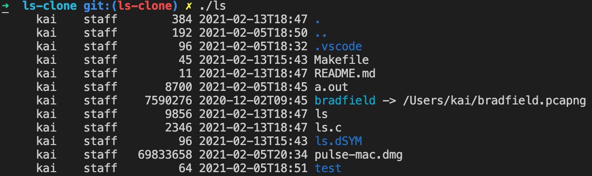

# ls-clone

## Building

```
make
```

## Usage

```
./ls [optional: dir name]
```

## Screenshots



## Notes

* Lists all files.
* Displays owner, group, size in bytes, last modified time in YYYY-MM-DDTHH-MM, and file name.
* Symlinks are expanded.
* Output is colorized (blue for directories, cyan for symlinks)
